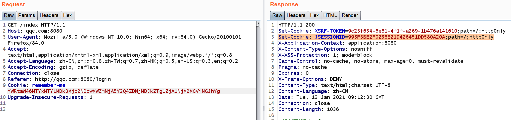
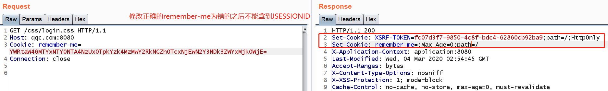

### 使用@WebFilter注解配置filter
在java-sec-code项目中发现某几个filter并没有在web.xml里注册，
```bash
/d/repos/java-sec-code (master)
$ find .|grep web.xml


```
但是在登录过程的处理中，命中了这几个filter，于是看看是什么原因。找到了类名上方的`@WebFilter`。

参考：
- [@WebFilter 的使用及采坑](https://www.cnblogs.com/muxi0407/p/11950627.html)

示例：
```java
import javax.servlet.annotation.WebFilter;

@WebFilter(filterName = "jsonpFilter", urlPatterns = "/*")
public class JsonpFilter implements Filter {
...
}


@WebFilter(filterName = "referFilter", urlPatterns = "/*")
public class ReferFilter implements Filter {
...
}
```


如此配置之后，就可以不必在 `web.xml` 中配置相应的 <filter> 和 <filter-mapping> 元素了，容器会在部署时根据指定的属性将该类发布为过滤器。它等价的 web.xml 中的配置形式为：
```
<filter> 
　　<filter-name>jsonpFilter</filter-name> 
　　<filter-class>JsonpFilter</filter-class> 
</filter> 
<filter-mapping> 
　　<filter-name>jsonpFilter</filter-name> 
　　<url-pattern>/*</url-pattern>
</filter-mapping>
```

### Spring的Filter
这里主要是Spring Security的Filter
```
org.springframework.security.web.context.request.async.WebAsyncManagerIntegrationFilter@7ab33ca8
org.springframework.security.web.context.SecurityContextPersistenceFilter@1d3d76b4
org.springframework.security.web.header.HeaderWriterFilter@2b9b17ce
org.springframework.web.filter.CorsFilter@704d3b00
org.springframework.security.web.csrf.CsrfFilter@3cd46491
org.springframework.security.web.authentication.logout.LogoutFilter@3b4bd341
org.springframework.security.web.authentication.UsernamePasswordAuthenticationFilter@75ed7512-----------这个filter用来进行用户名密码校验继承自AbstractAuthenticationProcessingFilter
org.springframework.security.web.savedrequest.RequestCacheAwareFilter@15d88c10
org.springframework.security.web.servletapi.SecurityContextHolderAwareRequestFilter@6d8b7ea9
org.springframework.security.web.authentication.rememberme.RememberMeAuthenticationFilter@33ebe4f0
org.springframework.security.web.authentication.AnonymousAuthenticationFilter@21e484b
org.springframework.security.web.session.SessionManagementFilter@274bae2c
org.springframework.security.web.access.ExceptionTranslationFilter@4a2e1e52
org.springframework.security.web.access.intercept.FilterSecurityInterceptor@5fd18419
```

这里可以对Referer、CSRFToken、CORS请求头，的CookieRememberMe、SessionId，用户名密码等进行校验。


#### Servlet和Filter


#### Spring Security原理
在J2EE的应用中，客户端想要调用Servlet逻辑，就需要在服务端在web.xml中将URL和Servlet进行配置（Mapping），当客户端向某个URL发起请求时，这个请求会自动发送给对应的处理这个URL的Servlet。

Servlet处理业务逻辑，在客户端的请求到达Servlet之前，需要配置Filter或者FilterChain（多个Filter串起来）进行拦截，以确保有效的用户请求进入到Servlet逻辑中。

`spring-boot-starter-security`这个依赖自动将Spring Security引入到Spring MVC或者其他非Spring Boot的项目中。

### remember-me这个Cookie
登录成功之后，如果请求中指定了要remember-me(`remember-me=true`。若未指定，则不返回`remember-me`这个Cookie)，服务端不仅返回有效的`JSESSIONID`，同时返回`remember-me`这个Cookie（这个名字是硬编码在Spring Security中的）
```http
POST /login HTTP/1.1
Host: qqc.com:8080
Content-Type: application/x-www-form-urlencoded; charset=UTF-8
X-XSRF-TOKEN: 36dd65b7-137c-4495-acdf-b54b669046b3
Content-Length: 49
Connection: close
Cookie: JSESSIONID=2D1245265D3F9E26BBE84CF6C1C0EF31; XSRF-TOKEN=36dd65b7-137c-4495-acdf-b54b669046b3

username=admin&password=admin123&remember-me=true


HTTP/1.1 200 
Set-Cookie: JSESSIONID=EAF416E4D3A9B9F8D0B4B1F25F88A471;path=/;HttpOnly
Set-Cookie: XSRF-TOKEN=;Max-Age=0;path=/;HttpOnly
Set-Cookie: XSRF-TOKEN=64a0b537-c4c8-4458-9ff9-42d0a65a964e;path=/;HttpOnly
Set-Cookie: remember-me=YWRtaW46MTYxMTY0NTA4NzUxOTpkYzk4MzMwY2RkNGZhOTcxNjEwN2Y3NDk3ZWYxMjk0Zg;Max-Age=1209600;path=/;HttpOnly
```

base64解密这个值，得到：
```
admin:1611645087519:dc98330cdd4fa9716107f7497ef1294Zg
```
通过读Spring Security代码，发现通过冒号分割的这三部分分别是：用户名、过期时间（指这个remember-me值有效的时间）、一个hash。
通过查看官方文档得知，
```java
    base64(username + ":" + expirationTime + ":" +
             md5Hex(username + ":" + expirationTime + ":" password + ":" + key))
             
    username:          As identifiable to the UserDetailsService
    password:          That matches the one in the retrieved UserDetails
    expirationTime:    The date and time when the remember-me token expires,
                       expressed in milliseconds
    key:               A private key to prevent modification of the remember-me token
```
所以如果不知道用户名密码、private key，是无法构造出来这个md5值的。

#### remember-me这个Cookie的作用
当带着这个Cookie访问时，服务端返回有效的JSESSIONID，可用于认证：
```http
GET /css/login.css HTTP/1.1
Host: qqc.com:8080
Cookie: remember-me=YWRtaW46MTYxMTY0NTA4NzUxOTpkYzk4MzMwY2RkNGZhOTcxNjEwN2Y3NDk3ZWYxMjk0Zg
Connection: close


HTTP/1.1 200 
Set-Cookie: XSRF-TOKEN=24265ee2-9bb2-4b7b-a607-baffd6816dcd;path=/;HttpOnly
Set-Cookie: JSESSIONID=1CEBB363D10C12E9C2B80A770FD2FD53;path=/;HttpOnly
X-Application-Context: application:8080
```
而使用修改过的错误的remember-me值访问时，不会返回JSESSIONID：
```
GET /css/login.css HTTP/1.1
Host: qqc.com:8080
Cookie: remember-me=YWRtaW46MTYxMTY0NTA4NzUxOTpkYzk4MzMwY2RkNGZhOTcxNjEwN2Y3NDk3ZWYxMjk0WjE=
Connection: close


HTTP/1.1 200 
Set-Cookie: XSRF-TOKEN=fc07d3f7-9850-4c8f-bdc4-62860cb92ba9;path=/;HttpOnly
Set-Cookie: remember-me=;Max-Age=0;path=/
```
再比如访问需要登录才能访问的/index，则在expirationTime之内，这个remember-me可以作为登录凭证，有JSESSIONID一样的效果。




### Spring中的CSRF防护
json的CSRF是否需要防御，看具体的应用。如果没有校验`Content-Type`，也是可能可以利用的。

CSRF token存储在`HttpSession`中，当HttpSession 过期后，会触发`InvalidCsrfTokenException`，响应`HTTP 403 Access Denied`。
如果不想让这个CSRF token过期，可以将token存储在Cookie中，这样虽然不如存储在Session中安全，但是大多场景下已经足够。

#### 使用方法
新建类继承自`org.springframework.security.config.annotation.web.configuration.WebSecurityConfigurerAdapter`，比如：
```java
@EnableWebSecurity
@Configuration
public class WebSecurityConfig extends WebSecurityConfigurerAdapter {

    @Value("${joychou.security.csrf.exclude.url}")    // 该值在application.properties中配置
    private String[] csrfExcludeUrl;
...
}
```

## 参考
- [Easy way to learn Spring Security 5](https://medium.com/@satyakm.dev/understanding-spring-security-internals-with-code-walkthrough-850d5749252c)
- https://docs.spring.io/spring-security/site/docs/3.2.0.CI-SNAPSHOT/reference/html/remember-me.html
- https://docs.spring.io/spring-security/site/docs/5.0.x/reference/html/csrf.html
