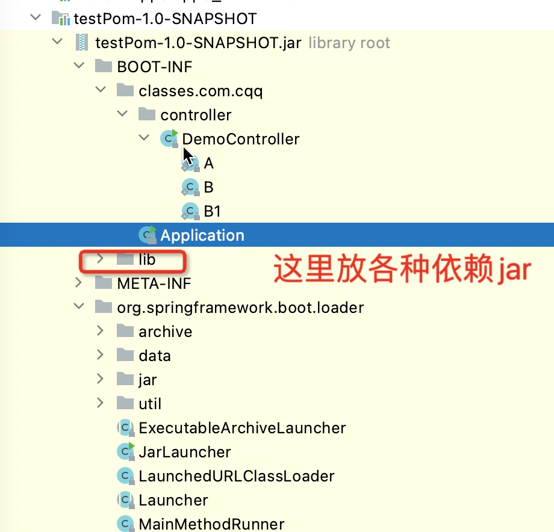
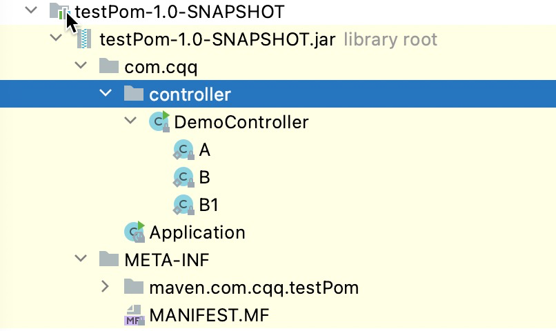
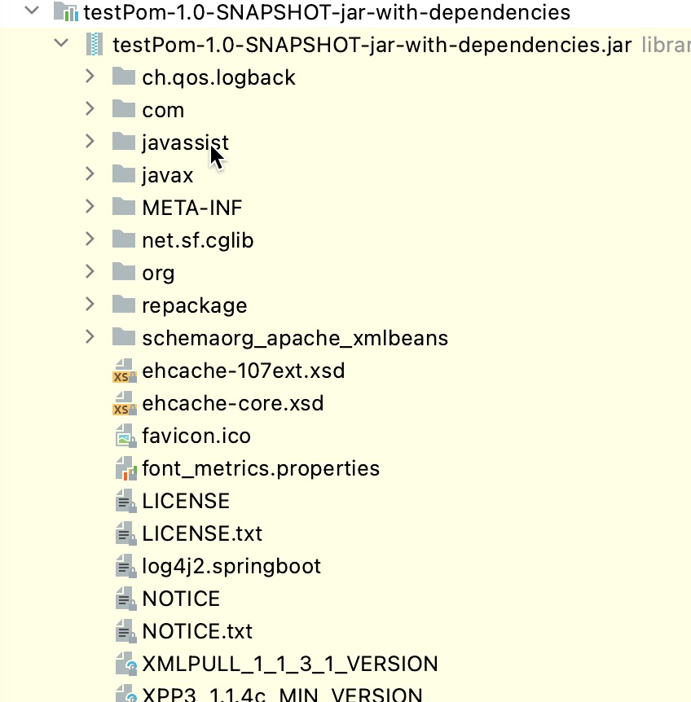

参考：
https://www.cnblogs.com/Narule/p/13200848.html
1、将依赖项以jar文件形式打包出来
```xml
<plugin>
    <groupId>org.springframework.boot</groupId>
    <artifactId>spring-boot-maven-plugin</artifactId>
</plugin>
```
打包之后：



2、注释掉之后：
再次打包：
只有几KB，没有SpringBoot，没有lib里的jar包

3、将依赖项以class文件形式打包出来

两种写法：
• 第一种：
```xml
<plugin>
    <artifactId>maven-assembly-plugin</artifactId>
    <configuration>
        <!--这部分可有可无,加上的话则直接生成可运行jar包-->
        <archive>
            <manifest>
                <mainClass>com.cqq.Application</mainClass>
            </manifest>
        </archive>
        <descriptorRefs>
            <descriptorRef>jar-with-dependencies</descriptorRef>
        </descriptorRefs>
    </configuration>
    <executions>
        <execution>
            <id>make-assembly</id>
            <phase>package</phase>
            <goals>
                <goal>single</goal>
            </goals>
        </execution>
    </executions>
</plugin>
```
到时候直接执行：
```
mvn clean package -DskipTests
```
参考：https://github.com/mbechler/marshalsec/blob/master/pom.xml

• 第二种：
```xml
<plugin>
    <artifactId>maven-assembly-plugin</artifactId>
    <configuration>
        <!--这部分可有可无,加上的话则直接生成可运行jar包-->
        <archive>
        <manifest>
        <mainClass>com.cqq.Application</mainClass>
        </manifest>
        </archive>
        <descriptorRefs>
            <descriptorRef>jar-with-dependencies</descriptorRef>
        </descriptorRefs>
    </configuration>
</plugin>
```
到时候执行：
```
mvn assembly:assembly
```
参考：
https://www.jianshu.com/p/f5c23e7205a7
